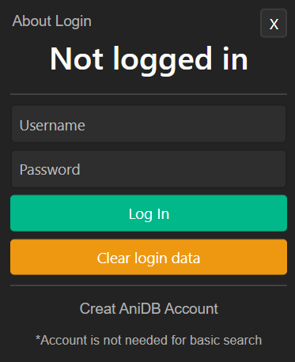

# AniDB Poster Downloader

## Description:

Electron application that allows you to quickly download poster for your anime. Developed mainly for people running media servers (Plex, Emby) or other software, that displays anime collection stored on hard drive using posters. Many of those programs support identifying a show and downloading a poster for it, but in case of an anime, results are not perfect. Program supports drag and drop functionality that allows user to quickly drop a folder with anime to it and download poster to this folder.

## Basic usage:
1. You can search anime poster by typing in "Search Anime" textarea and then clicking search or pressing "enter" key. Then you can choose folder to which you want to downlad poster.

 

2. You can drag and drop already existing folder or video file with anime and app will automatically take path of this folder and search for this anime.

 

## 3. After successful search
* You can select any of displayed posters and download it. Selected poster will be displayed in right window
* You can change download path by selecting folder image. It will open windows explorer
* You can search for another anime by inputing new name in anime search text area and clicki search

## 4. Additional features

* You can clear search results by clickg refresh icon in top left corner.
* Next to it is login icon that opens login window.

* You can login to AniDB to search restricted content.
* Provide login and password and clock "Log in" button. App will remeber you by saving your session in cookies.
* After clicking login button chrome will open on top on the app and automatically log you in.  It is advised to not do anything during this process. It shouldn't take longer than 10s. 
* You can clear all your provided data and cookies by clicking "Clear login data" button.

### 5. Additional information
- App was tested on windows 10. In general it should work on other OS too, but it might have some path issues on saving files to computer so I don't provide binary for other platforms. 
- Your login, password and cookies on windows are stored in: AppData\Roaming\AniDB Poster Downloader\AniDB Poster Downloader
- App comes with unistaller so you can easly remove it from system.
- App installer will install app to default location on your system drive. 
- App has around 520MB. It weights so much because it comes with internal chrome browser that is used for searching and it weights 350MB. This chrome is independed of your current browsers. Uninstaller will delete internal chrome too.
- App uses web scraping to download posters. It means that it uses internal chrome in background to literraly simulate visiting AniDB by you and takes data from visited site.
   
 
### Download app here: https://github.com/piotrkraszewski/AniDB-Poster-Downloader/releases

 

# How to develop the app

To run app in developer mode use:

`yarn start`

To create exe file for the app use command below. It will create exe files for your app and installer in relsease folder inside project files:

`yarn package`

To add dependency package use this syntax:

`yarn add "package name"` 

 

This project don't use `npm` so don't try any command with it because it will brake it. Unless of course you want to switch to `npm`.